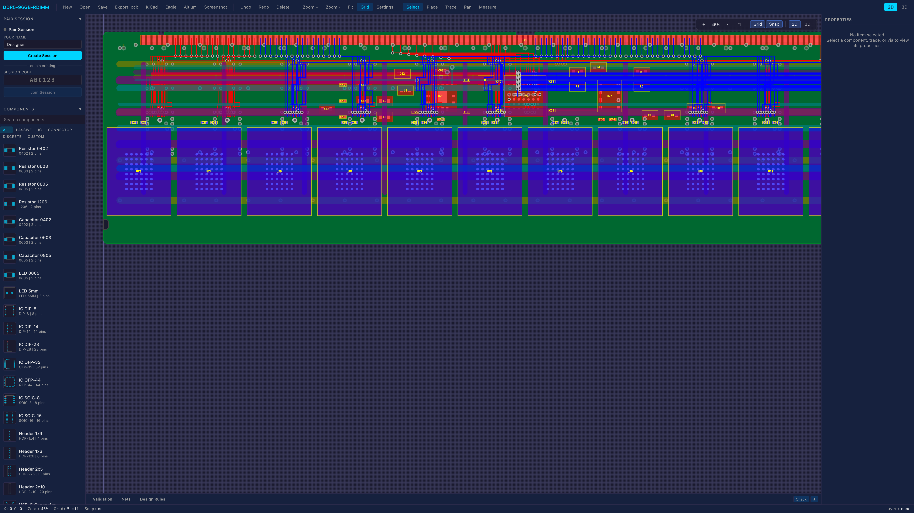

# PCB Layout

A modular PCB design and layout platform with a 2D grid-based editor, 3D board visualization, real-time collaborative sessions, and a REST + WebSocket API backend. Supports web and Electron desktop clients built from a shared codebase.


*DDR5-96GB-RDIMM — 107 components, 1947 trace segments, 1156 vias, 10-layer stack rendered in the 2D editor*

## Features

- **Infinite 2D canvas** with pan, zoom, snap-to-grid placement, and drag-and-drop editing (PixiJS)
- **3D board rendering** for final inspection with layer stack visualization (Three.js)
- **Multi-layer PCB design** with layer visibility toggles and lock/unlock controls
- **Via placement** during trace routing -- press `V` to insert a via and switch signal layers
- **Modular design workflow** -- create reusable circuit modules and assemble them into larger boards
- **Trace routing** with stable path IDs, segment-level geometry, configurable corner radius, and fill patterns
- **Silkscreen labels** -- place text labels or SVG mask artwork on silkscreen layers
- **Mounting holes** -- standalone drill holes (plated or non-plated) on mechanical layers
- **Fill patterns** -- 19 pattern styles for traces and copper pours (solid, hatched, dashed, cross-hatch, etc.)
- **Design rule validation** including via-trace z-axis layer connectivity checking
- **Real-time collaboration** via WebSocket sessions with cursor sharing and live board mutations
- **Undo/redo** via a command pattern history stack
- **REST API** for programmatic CRUD on projects, boards, components, modules, paths, nets, sessions, and validation
- **Export** projects as `.pcb`, KiCad (`.kicad_pcb`), Eagle (`.brd`), or Altium (`.PcbDoc`)
- **Screenshots** -- capture the board as PNG via toolbar button (client-side canvas capture or server-side headless Puppeteer)
- **HMR-safe state** -- editor state persists across hot-reload during development
- **Cross-platform** -- web browser and Electron desktop clients share the same editor core

## Tech Stack

| Layer | Technology |
|---|---|
| Language | TypeScript 5.7 |
| Runtime | Node.js / Bun |
| Backend | Fastify 5 |
| Real-time | @fastify/websocket |
| Frontend | React 18, Vite |
| 2D Rendering | PixiJS 8 |
| 3D Rendering | Three.js 0.170 |
| State Management | Zustand 5 |
| Desktop | Electron 33 |
| Screenshots | Puppeteer (headless Chrome) |
| Testing | Vitest 3 |

## Monorepo Structure

```
pcb-layout/
  apps/
    api-server/        # Fastify REST + WebSocket API (port 3001)
    web-client/        # React + Vite web app (port 5173)
    electron-client/   # Electron desktop wrapper
  packages/
    domain/            # Core types -- board, component, geometry, trace, module, net, hole, silkscreen
    api-contracts/     # Shared request/response types for the API
    editor-core/       # Framework-agnostic editor controller, tools, commands, viewport
    render-pixi/       # 2D rendering -- canvas, board, component, trace, grid, silkscreen renderers
    render-three/      # 3D rendering -- scene builder, layer stack, board extrusion
    rules-engine/      # Design rule checking (clearance, trace width, via layer connectivity)
    project-serialization/  # Project save/load, export (PCB, KiCad, Eagle, Altium)
    ui-components/     # Reusable React UI components
```

## Getting Started

### Prerequisites

- [Node.js](https://nodejs.org/) >= 18
- [Bun](https://bun.sh/) (used for running dev scripts)

### Install

```bash
npm install
```

### Development

Start the API server and web client concurrently:

```bash
npm run dev
```

This runs:
- **API server** at `http://localhost:3001`
- **Web client** at `http://localhost:5173`

Editor state is automatically persisted to `sessionStorage`, so Vite HMR and file-change reloads will not lose your work.

### Build

```bash
npm run build
```

### Test

```bash
npm run test          # single run (167 tests)
npm run test:watch    # watch mode
```

## Architecture

```
Web / Electron Client
  ├─ Zustand Store (board, editor, module, project, session slices)
  │    └─ sessionStorage persistence (survives HMR)
  ├─ Editor Core (tools: select, place, trace + via, measure, pan)
  │    ├─ Render Pixi (2D canvas, grid, components, traces, silkscreen, mounting holes)
  │    └─ Render Three (3D board, layer stack, vias, traces)
  └─ useSession hook (WebSocket real-time collaboration)

REST + WebSocket API (Fastify)
  ├─ Routes: /api/projects, /api/boards, /api/components,
  │          /api/modules, /api/paths, /api/nets, /api/validation
  ├─ Session Manager: /api/sessions, /ws/session/:code
  ├─ Export: /api/projects/:id/export?format=pcb|kicad_pcb|brd|PcbDoc
  └─ In-memory store
```

Both renderers derive from the shared **domain** package, ensuring 2D and 3D representations stay in sync with a single canonical board model.

## Editor Tools

| Tool | Description |
|---|---|
| Select | Click or marquee-select components and traces |
| Place | Snap-to-grid component placement with rotation |
| Trace | Interactive copper trace routing between pads. Press **V** to insert a via and switch signal layers. |
| Measure | Distance measurement overlay |
| Pan | Viewport panning |

---

## API Reference

Base URL: `http://localhost:3001`

All coordinates are in **mils** (thousandths of an inch). Grid snap is 5 mils. All IDs are prefixed branded strings (e.g. `proj_abc123`, `board_def456`).

### Response Envelope

All successful responses returning a single entity use:

```json
{
  "data": { ... }
}
```

All successful responses returning a list use:

```json
{
  "data": [ ... ],
  "total": 5
}
```

All error responses use:

```json
{
  "statusCode": 404,
  "error": "Not Found",
  "message": "Project not found"
}
```

### Health Check

```
GET /health
```

Returns `{ "status": "ok", "timestamp": "..." }`.

---

### Projects

#### List all projects

```
GET /api/projects
```

**Response** `200` -- `{ data: Project[], total: number }`

#### Create a project

```
POST /api/projects
Content-Type: application/json
```

**Request body**

```json
{
  "name": "My Board",
  "description": "A PCB project",
  "settings": {
    "defaultGridSpacing": 5,
    "defaultLayerCount": 4,
    "units": "mils"
  }
}
```

| Field | Type | Required | Description |
|---|---|---|---|
| `name` | string | yes | Project name |
| `description` | string | yes | Project description |
| `settings` | object | no | Partial `ProjectSettings` override |
| `settings.defaultGridSpacing` | number | no | Grid spacing in mils (default: 5) |
| `settings.defaultLayerCount` | number | no | Default layer count (default: 2) |
| `settings.defaultBoardWidth` | number | no | Default board width in mils (default: 3000) |
| `settings.defaultBoardHeight` | number | no | Default board height in mils (default: 2000) |
| `settings.units` | `"mils"` \| `"mm"` | no | Coordinate unit system (default: `"mils"`) |

**Response** `201`

#### Get / Update / Delete a project

```
GET    /api/projects/:id          → 200 / 404
PUT    /api/projects/:id          → 200 / 404  (all fields optional)
DELETE /api/projects/:id          → 204 / 404
```

#### Export a project

```
GET /api/projects/:id/export?format=pcb
```

| Query Param | Type | Default | Description |
|---|---|---|---|
| `format` | string | `pcb` | One of `pcb`, `kicad_pcb`, `brd`, `PcbDoc` |

Returns the serialized project as a file download with `Content-Disposition: attachment`.

```
GET /api/export/formats
```

Returns the list of supported export formats and their MIME types.

**Response** `200` / `404`

---

### Boards

#### List all boards

```
GET /api/boards
GET /api/boards?projectId=proj_...
```

**Response** `200` -- `{ data: Board[], total: number }`

#### Create a board

```
POST /api/boards
Content-Type: application/json
```

```json
{
  "projectId": "proj_...",
  "name": "Main Board",
  "workspace": { "width": 4000, "height": 3000, "layerCount": 4 }
}
```

| Field | Type | Required | Description |
|---|---|---|---|
| `projectId` | string | yes | Parent project ID |
| `name` | string | yes | Board name |
| `workspace` | object | no | Partial `WorkspaceConfig` (default: 3000x2000, 5-mil grid, 2 layers) |

**Response** `201`

#### Get / Update / Delete a board

```
GET    /api/boards/:id            → 200 / 404
PUT    /api/boards/:id            → 200 / 404
DELETE /api/boards/:id            → 204 / 404
```

#### Board layers

```
GET /api/boards/:id/layers        → 200 / 404
PUT /api/boards/:id/layers        → 200 / 404  (replaces all layers)
```

**Layer types**: `signal`, `plane`, `silkscreen_top`, `silkscreen_bottom`, `solder_mask_top`, `solder_mask_bottom`, `paste_top`, `paste_bottom`, `mechanical`

---

### Components

```
GET    /api/components?boardId=board_...     → 200
POST   /api/components                        → 201
GET    /api/components/:id                    → 200 / 404
PUT    /api/components/:id                    → 200 / 404
DELETE /api/components/:id                    → 204 / 404
```

**Create request body**

```json
{
  "boardId": "board_...",
  "name": "100nF Cap",
  "designator": "C1",
  "footprint": {
    "id": "fp_...",
    "name": "0402",
    "description": "0402 capacitor footprint",
    "pads": [
      {
        "id": "pad_...", "componentId": "comp_...", "name": "1",
        "localPosition": { "x": -25, "y": 0 },
        "shape": "rect", "width": 20, "height": 25, "rotation": 0,
        "layerId": "layer_...", "plated": true
      }
    ],
    "pins": [
      { "id": "pin_...", "padId": "pad_...", "name": "1", "number": "1", "electricalType": "passive" }
    ],
    "boundingBox": { "min": { "x": -35, "y": -15 }, "max": { "x": 35, "y": 15 } },
    "courtyard": { "min": { "x": -45, "y": -25 }, "max": { "x": 45, "y": 25 } }
  },
  "transform": { "position": { "x": 500, "y": 300 }, "rotation": 0, "mirrored": false },
  "layerId": "layer_...",
  "properties": { "value": "100nF", "package": "0402" },
  "locked": false
}
```

---

### Modules

Modules are reusable circuit blocks that can be instantiated onto boards.

```
GET    /api/modules                           → 200
POST   /api/modules                           → 201
GET    /api/modules/:id                       → 200 / 404
PUT    /api/modules/:id                       → 200 / 404
DELETE /api/modules/:id                       → 204 / 404
GET    /api/modules/:id/components            → 200 / 404
POST   /api/modules/:id/validate              → 200 / 404
POST   /api/modules/:id/instantiate           → 201 / 404
GET    /api/modules/:id/versions              → 200 / 404
```

---

### Nets

Nets represent electrical connections between pins and pads.

```
GET    /api/nets?boardId=board_...            → 200
POST   /api/nets                              → 201
GET    /api/nets/:id                          → 200 / 404
PUT    /api/nets/:id                          → 200 / 404
DELETE /api/nets/:id                          → 204 / 404
```

---

### Trace Paths

Trace paths are copper routing segments between pads/pins. Each path belongs to a net and consists of ordered segments, optional vias, a corner radius, and an optional fill pattern.

```
GET    /api/paths?boardId=...&netId=...       → 200
POST   /api/paths                             → 201
GET    /api/paths/:id                         → 200 / 404
PUT    /api/paths/:id                         → 200 / 404
DELETE /api/paths/:id                         → 204 / 404
GET    /api/paths/:id/debug                   → 200 / 404
POST   /api/paths/:id/debug                   → 201 / 404
```

**Create request body**

```json
{
  "netId": "net_...",
  "boardId": "board_...",
  "segments": [
    { "layerId": "layer_...", "start": { "x": 100, "y": 200 }, "end": { "x": 300, "y": 200 }, "width": 10 }
  ],
  "vias": [
    {
      "position": { "x": 300, "y": 200 },
      "fromLayerId": "layer_top",
      "toLayerId": "layer_bottom",
      "outerDiameter": 30,
      "drillDiameter": 15,
      "netId": "net_..."
    }
  ]
}
```

---

### Validation

#### Validate a board

```
POST /api/validation/board/:id
```

**Rules**: `board.layers.required`, `board.dimensions.positive`, `component.bounds`, `net.connections.required`

#### Validate via-trace layer connectivity (z-axis)

```
POST /api/validation/board/:id/vias
```

Validates that every via's `fromLayerId` and `toLayerId` match the layers of the trace segments physically touching that via. Catches orphan vias and layer mismatches across the z-axis.

**Rules**:
- `via.orphan` -- error if via has no touching trace segments
- `via.layer.from` -- error if via's `fromLayerId` has no segment on that layer
- `via.layer.to` -- error if via's `toLayerId` has no segment on that layer

**Response** `200`

```json
{
  "data": {
    "valid": false,
    "results": [
      {
        "rule": "via.layer.from",
        "severity": "error",
        "message": "Via via_abc fromLayer layer_inner has no connecting segment on that layer",
        "location": { "entityType": "via", "entityId": "via_abc" }
      }
    ],
    "totalVias": 4,
    "checkedAt": "2026-03-30T00:00:00.000Z"
  }
}
```

#### Validate a module

```
POST /api/validation/module/:id
```

**Rules**: `module.components.required`, `module.exposedPins.required`, `module.boundingBox.valid`

---

### Sessions (Real-time Collaboration)

Sessions enable multiple participants (human designers or AI agents) to work on a board simultaneously with live cursor sharing and synchronized board mutations.

#### Create a session

```
POST /api/sessions
Content-Type: application/json
```

```json
{
  "boardId": "board_...",
  "projectId": "proj_..."
}
```

**Response** `201`

```json
{
  "data": {
    "code": "A3X7K9",
    "boardId": "board_...",
    "projectId": "proj_...",
    "hostId": "",
    "participants": [],
    "createdAt": "..."
  }
}
```

#### List / Get / Delete sessions

```
GET    /api/sessions                          → 200
GET    /api/sessions/:code                    → 200 / 404
DELETE /api/sessions/:code                    → 204 / 404
```

#### Join a session (REST -- agent-friendly)

```
POST /api/sessions/:code/join
Content-Type: application/json
```

```json
{
  "name": "Agent-1",
  "role": "agent"
}
```

| Field | Type | Required | Description |
|---|---|---|---|
| `name` | string | yes | Participant display name |
| `role` | `"human"` \| `"agent"` | no | Participant role (default: `"agent"`) |

**Response** `201` -- `{ data: { participant, session } }`

#### Leave a session (REST)

```
POST /api/sessions/:code/leave
Content-Type: application/json
```

```json
{ "participantId": "p_..." }
```

**Response** `204` / `404`

#### Push a board event (REST -- agent-friendly)

```
POST /api/sessions/:code/events
Content-Type: application/json
```

```json
{
  "participantId": "p_...",
  "action": {
    "kind": "component:create",
    "data": { "name": "R1", "designator": "R1", ... }
  }
}
```

**Supported action kinds**: `component:create`, `component:update`, `component:delete`, `path:create`, `path:update`, `path:delete`, `net:create`, `net:update`, `net:delete`, `layer:update`, `board:update`

**Response** `200` -- `{ data: { action, result } }`

#### Poll session snapshot (REST)

```
GET /api/sessions/:code/snapshot
```

Returns the current board state (board, components, nets, paths) for agents that cannot use WebSocket.

**Response** `200` / `404`

#### WebSocket endpoint

```
ws://localhost:3001/ws/session/:code
```

**Client messages** (JSON):

| Type | Fields | Description |
|---|---|---|
| `join` | `name`, `role` | Join the session |
| `leave` | -- | Leave the session |
| `cursor` | `x`, `y` | Broadcast cursor position |
| `select` | `ids` | Broadcast selected entity IDs |
| `tool` | `tool` | Broadcast active tool change |
| `layer` | `layerId` | Broadcast active layer change |
| `board-event` | `action` | Broadcast a board mutation |

**Server messages** (JSON):

| Type | Fields | Description |
|---|---|---|
| `session-info` | `session` | Full session state on join |
| `participant-joined` | `participant` | New participant joined |
| `participant-left` | `participantId` | Participant left |
| `cursor-update` | `participantId`, `x`, `y` | Remote cursor moved |
| `selection-update` | `participantId`, `ids` | Remote selection changed |
| `tool-update` | `participantId`, `tool` | Remote tool changed |
| `layer-update` | `participantId`, `layerId` | Remote layer changed |
| `board-event` | `participantId`, `action`, `result` | Board mutation broadcast |
| `error` | `message` | Error message |

---

### Shared Type Reference

#### Point2D

```json
{ "x": 100, "y": 200 }
```

All coordinates are in mils.

#### BoundingBox

```json
{ "min": { "x": 0, "y": 0 }, "max": { "x": 500, "y": 300 } }
```

#### Transform2D

| Field | Type | Description |
|---|---|---|
| `position` | Point2D | World position in mils |
| `rotation` | number | `0`, `90`, `180`, or `270` degrees |
| `mirrored` | boolean | Horizontal mirror state |

#### GridConfig

```json
{ "spacingX": 5, "spacingY": 5, "subdivisions": 2, "visible": true, "snapEnabled": true }
```

#### WorkspaceConfig

```json
{ "width": 3000, "height": 2000, "grid": { ... }, "layerCount": 2 }
```

#### ID Formats

| Entity | Prefix | Example |
|---|---|---|
| Project | `proj` | `proj_a1b2c3d4-...` |
| Board | `board` | `board_a1b2c3d4-...` |
| Layer | `layer` | `layer_a1b2c3d4-...` |
| Component | `comp` | `comp_a1b2c3d4-...` |
| Footprint | `fp` | `fp_a1b2c3d4-...` |
| Pad | `pad` | `pad_a1b2c3d4-...` |
| Pin | `pin` | `pin_a1b2c3d4-...` |
| Net | `net` | `net_a1b2c3d4-...` |
| TracePath | `trace` | `trace_a1b2c3d4-...` |
| TraceSegment | `seg` | `seg_a1b2c3d4-...` |
| Via | `via` | `via_a1b2c3d4-...` |
| Module | `mod` | `mod_a1b2c3d4-...` |
| ModuleInstance | `mi` | `mi_a1b2c3d4-...` |
| DebugLink | `dbg` | `dbg_a1b2c3d4-...` |
| DesignRule | `rule` | `rule_a1b2c3d4-...` |
| MountingHole | `mh` | `mh_a1b2c3d4-...` |
| SilkscreenLabel | `silk` | `silk_a1b2c3d4-...` |

#### Enum Values

**LayerType**: `signal`, `plane`, `silkscreen_top`, `silkscreen_bottom`, `solder_mask_top`, `solder_mask_bottom`, `paste_top`, `paste_bottom`, `mechanical`

**PadShape**: `circle`, `rect`, `oval`, `polygon`

**PinElectricalType**: `input`, `output`, `bidirectional`, `power`, `ground`, `passive`, `unconnected`

**DebugSeverity**: `info`, `warning`, `error`, `critical`

**DesignRuleType**: `min_trace_width`, `min_clearance`, `min_drill_size`, `min_annular_ring`, `max_via_count`, `trace_to_edge`, `component_to_edge`

**Rotation**: `0`, `90`, `180`, `270`

**FillPattern**: `solid`, `sparse_dot`, `hatch`, `reverse_hatch`, `horizontal_stripe`, `vertical_stripe`, `dash_short_h`, `dash_short_v`, `dash_short_diag`, `dash_short_rdiag`, `dash_medium_h`, `dash_medium_v`, `dash_medium_diag`, `dash_medium_rdiag`, `dash_long_h`, `dash_long_v`, `dash_long_diag`, `dash_long_rdiag`, `cross_hatch`

**SilkscreenContentType**: `text`, `svg`

**ParticipantRole**: `human`, `agent`

#### SilkscreenLabel

Text label:

```json
{
  "id": "silk_...", "layerId": "layer_...",
  "position": { "x": 100, "y": 200 }, "rotation": 0,
  "contentType": "text", "text": "REV A", "fontSize": 40, "fontFamily": "monospace",
  "locked": false
}
```

SVG mask:

```json
{
  "id": "silk_...", "layerId": "layer_...",
  "position": { "x": 500, "y": 500 }, "rotation": 0,
  "contentType": "svg", "svgContent": "<svg>...</svg>", "svgWidth": 200, "svgHeight": 100,
  "locked": false
}
```

#### MountingHole

```json
{
  "id": "mh_...", "position": { "x": 100, "y": 100 },
  "diameter": 125, "plated": false, "layerId": "layer_...", "locked": false
}
```

---

### Screenshots

#### Capture board as PNG

```
GET /api/boards/:id/screenshot?mode=2d&width=1920&height=1080
```

| Query Param | Type | Default | Description |
|---|---|---|---|
| `mode` | `"2d"` \| `"3d"` | `"2d"` | Render mode |
| `width` | number | `1920` | Viewport width in pixels |
| `height` | number | `1080` | Viewport height in pixels |

Returns a PNG image rendered via headless Chrome (Puppeteer). The web client's **Screenshot** button uses client-side canvas capture first and falls back to this endpoint.

**Response** `200` -- `image/png`
**Response** `404` -- board not found
**Response** `500` -- render failed

---

## Collaborative Agent Team

PCB design audits can be performed by a team of specialized AI agents working in a real-time session. Each agent joins the session via the REST API, performs its audit, and posts findings as board events visible to all participants.

### Agent Roster

| Agent | Role | Responsibilities |
|---|---|---|
| **PM-Agent** | Project Manager | Inventory verification, unit test status, objective tracking, consolidated reporting |
| **Layout-Specialist** | Component Placement | Same-layer body overlap detection, out-of-bounds checks, IC-cutout conflicts, clearance gap analysis |
| **Profile-Specialist** | Board Outline | JEDEC dimension compliance, notch positions/depths, fillet radii, retention clip cutouts, component-cutout clearance |
| **Trace-Specialist** | Trace Routing | Layer assignment validation (power vs signal), trace width minimums, segment connectivity, dangling trace detection |
| **Via-Specialist** | Via Connectivity | Orphan via detection, drill size validation, annular ring checks, via-component overlap analysis, layer pair verification |
| **Material-Specialist** | Layer Stack | Component-to-layer assignment, layer type verification (signal/plane/silkscreen/mask), orphan layer references, via layer refs |

### Setting Up a Team Session

```bash
# 1. Create a session
curl -X POST http://localhost:3001/api/sessions \
  -H 'Content-Type: application/json' \
  -d '{"boardId":"brd_...", "projectId":"proj_..."}'
# Returns: { "data": { "code": "ABC123", ... } }

# 2. Join agents
for AGENT in "PM-Agent" "Layout-Specialist" "Profile-Specialist" \
             "Trace-Specialist" "Via-Specialist" "Material-Specialist"; do
  curl -X POST http://localhost:3001/api/sessions/ABC123/join \
    -H 'Content-Type: application/json' \
    -d "{\"name\":\"$AGENT\",\"role\":\"agent\"}"
done

# 3. Each agent posts findings via:
curl -X POST http://localhost:3001/api/sessions/ABC123/events \
  -H 'Content-Type: application/json' \
  -d '{"participantId":"p_...", "action":{"kind":"board:update","data":{"audit":"component","status":"PASS","overlaps":0}}}'

# 4. Poll session snapshot for current state:
curl http://localhost:3001/api/sessions/ABC123/snapshot
```

### Agent Communication Flow

```
PM-Agent (coordinator)
  ├─ Layout-Specialist  → component placement audit
  ├─ Profile-Specialist → board outline audit
  ├─ Trace-Specialist   → routing & layer audit
  ├─ Via-Specialist     → via connectivity audit
  └─ Material-Specialist → layer stack audit
       │
       └─ All agents POST findings to session → PM consolidates
```

Each agent should:
1. `GET /api/sessions/{code}/snapshot` for board state
2. `GET /api/boards/{boardId}` for profile and layer data
3. Run its checks against the data
4. `POST /api/sessions/{code}/events` with structured findings
5. Report status as `PASS`, `WARN`, or `FAIL`

---

## Writing Validation Tests

The rules engine at `packages/rules-engine` contains 30+ validation checkers. Tests live in `packages/rules-engine/src/__tests__/`.

### Test Types

#### 1. Synthetic fixture tests (unit tests)

Test individual rules with controlled data. Use the helpers from `packages/domain/src/__tests__/fixtures.ts`:

```typescript
import { describe, it, expect, beforeEach } from 'vitest';
import { ValidationEngine } from '../engine';
import { createTestBoard, createTestComponent, createTestTracePath } from '@fixtures';

let engine: ValidationEngine;
beforeEach(() => { engine = new ValidationEngine(); });

it('detects component body overlap', () => {
  const u1 = makeComp('U1', 500, 500, 300, 400);
  const c1 = makeComp('C1', 500, 500, 44, 18); // same position = overlap

  const result = engine.validate({
    board: createTestBoard(),
    components: [u1, c1],
    nets: [], paths: [],
    rules: engine.getDefaultRules(),
  });

  const overlaps = result.violations.filter(v => v.message.includes('overlap'));
  expect(overlaps.length).toBeGreaterThan(0);
});
```

#### 2. Board-level regression tests (integration tests)

Test rules against the actual PCB file. See `ddr5-board.test.ts` for examples:

```typescript
it('detects via with wrong layer assignment', () => {
  const seg1 = makeSeg('s1', 'p1', 100, 100, 200, 100, 5);           // top layer
  const seg2 = { ...makeSeg('s2', 'p1', 200, 100, 300, 100, 5), layerId: botLayer.id }; // bottom

  const path = {
    id: 'p1', netId: 'net_a',
    segments: [seg1, seg2],
    vias: [{
      id: 'via_1', pathId: 'p1', position: { x: 200, y: 100 },
      fromLayerId: topLayer.id,
      toLayerId: 'lyr_wrong',  // deliberate mismatch
      outerDiameter: 30, drillDiameter: 15, netId: 'net_a',
    }],
    debugLinks: [], cornerRadius: 0,
  };

  const result = engine.validate(makeCtx({ paths: [path] }));
  expect(result.violations.some(v => v.message.includes('Via'))).toBe(true);
});
```

#### 3. PCB file regression tests (programmatic)

Load the actual board file and assert zero violations. See `ddr5-overlap-regression.test.ts`:

```typescript
import * as fs from 'node:fs';

function loadBoard() {
  const raw = JSON.parse(fs.readFileSync('examples/DDR5-96GB-RDIMM.json', 'utf-8'));
  return raw.project.boards[0];
}

it('has no same-layer body overlaps', () => {
  const board = loadBoard();
  // Group components by layer, check all pairs
  const overlaps = findBodyOverlaps(board.components, board.layers);
  expect(overlaps).toHaveLength(0);
});
```

### Available Validation Rules

| Rule | Category | Severity | Description |
|---|---|---|---|
| `component-clearance` | Clearance | error | Courtyard-to-courtyard minimum distance |
| `component-overlap` | Clearance | error/warn | Courtyard overlap with buffer enforcement |
| `component-body-overlap` | Clearance | error | Physical body collision detection |
| `trace-clearance` | Clearance | error | Same-layer different-net trace spacing |
| `trace-to-component-clearance` | Clearance | error | Trace passing through/near component courtyard |
| `trace-to-board-edge-clearance` | Clearance | error | Trace too close to board edge |
| `min-trace-width` | Trace | error | Trace segment below minimum width |
| `trace-connectivity` | Trace | error | Segment endpoints don't connect |
| `trace-layer-assignment` | Trace | warning | Power net on signal layer or vice versa |
| `trace-endpoint-alignment` | Trace | warning | Dangling trace not connected to pad/via |
| `via-drill-size` | Via | error | Drill diameter below minimum |
| `via-annular-ring` | Via | error | Ring width below minimum |
| `via-layer-connectivity` | Via | error | Via from/to layers don't match segments |
| `component-within-bounds` | Component | error | Component extends beyond board |
| `ic-within-board-edge` | Component | error | IC courtyard off board edge or in cutout |
| `component-on-valid-layer` | Component | error | Component on non-signal layer |
| `pad-net-assignment` | Component | warning | Pad not assigned to any net |
| `net-connectivity` | Net | error | Net has disconnected islands |
| `floating-net` | Net | warning | Net with no connections |
| `short-circuit` | Net | error | Different nets electrically connected |

### Saving Design Rules Per Board

```bash
# Seed default rules
POST /api/boards/{boardId}/rules/defaults

# Customize for DDR5
PUT /api/boards/{boardId}/rules/{ruleId}
{"value": 3, "unit": "mil", "netClass": "ddr5_signal"}

# Add custom rule
POST /api/boards/{boardId}/rules
{"type": "min_clearance", "name": "BGA Clearance", "value": 3, "unit": "mil"}

# Validation uses saved rules when available
POST /api/validation/board/{boardId}
```

---

## License

MIT -- see [LICENSE](LICENSE).
